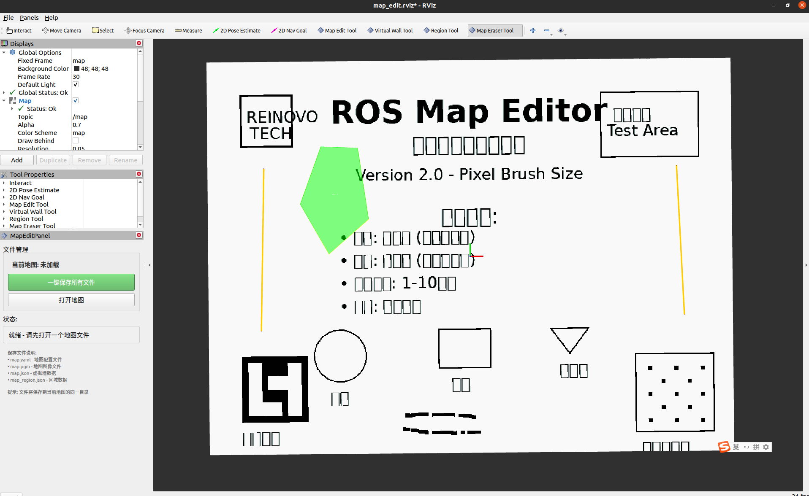

# ROS Map Edit Plugin

一个用于RViz的地图编辑插件，支持虚拟墙绘制、区域标记和地图擦除功能。



## 项目构建

### 系统环境要求
Ubuntu 18.04 / 20.04
ROS Melodic / Noetic

```bash
sudo apt install -y \
  libyaml-cpp-dev \
  libopencv-dev \
  qtbase5-dev \
  qttools5-dev-tools \
  libcurl4-openssl-dev \
  pkg-config
```

### FTP测试依赖 (可选)
```bash
# 用于运行FTP测试服务器
sudo apt install python3-pyftpdlib
```

## 功能特点

### 🖤⚪ 黑白橡皮擦工具 (MapEraserTool)
- **左键**: 画黑色 (添加障碍物)
- **右键**: 画白色 (清除障碍物) 
- **拖拽**: 连续绘制
- **笔刷大小**: 1-10像素，可在属性面板调节

### 🧱 虚拟墙工具 (VirtualWallTool) 
- **限制**: 只能绘制两个点的墙体
- **左键**: 依次点击两个点创建墙体
- **右键**: 取消当前墙体绘制
- **自动完成**: 点击第二个点后自动完成墙体

### 📐 区域工具 (RegionTool)
- **左键**: 添加多边形顶点
- **右键**: 完成当前多边形区域
- **可视化**: 实时显示多边形填充和边界

### 💾 一键保存
- **统一保存**: 一个按钮保存所有文件
- **文件格式**:
  - `map.yaml` - 地图配置文件
  - `map.pgm` - 地图图像文件
  - `map.json` - 虚拟墙数据
  - `map_region.json` - 区域数据

### 🌐 智能地图加载 (新功能)
- **本地地图**: 从文件系统选择YAML/PGM地图文件
- **远程地图**: 通过FTP服务器下载地图文件
- **自动关联**: 自动加载对应的虚拟墙和区域文件
- **可视化界面**: 选项卡式UI，支持FTP配置和文件列表

### 📡 FTP远程功能
- **服务器配置**: IP地址、端口、用户名、密码设置
- **连接测试**: 一键测试FTP连接状态
- **文件浏览**: 远程目录文件列表显示
- **自动下载**: 选择文件后自动下载并加载到RViz

## 安装和使用

### 1. 编译
```bash
cd ~/ros_ws/cursor_ws
catkin_make
source devel/setup.bash
```

### 2. 启动系统
```bash
# 启动编辑器
roslaunch ros_map_edit map_edit.launch

# 或者启动UI测试模式
roslaunch ros_map_edit test_ui.launch
```

### 3. 添加MapEditPanel到RViz
1. 在RViz中选择 `Panels` -> `Add New Panel`
2. 选择 `ros_map_edit` -> `MapEditPanel`
3. 面板会出现在RViz界面中

### 4. 设置FTP测试服务器 (可选)
```bash
# 在新终端中启动测试FTP服务器
cd ~/ros_ws/cursor_ws/src/ros_map_edit/scripts
python3 test_ftp_server.py

# 测试连接参数:
# 服务器: localhost
# 端口: 2121
# 用户名: admin
# 密码: admin123
# 目录: /maps
```

### 5. 使用地图加载功能

#### 本地地图加载:
1. 在`MapEditPanel`中切换到"本地地图"选项卡
2. 点击"选择本地地图文件"按钮
3. 选择YAML或PGM地图文件
4. 地图及对应的虚拟墙、区域文件会自动加载

#### 远程地图加载 (FTP):
1. 切换到"远程地图 (FTP)"选项卡
2. 配置FTP服务器信息（IP、端口、用户名、密码、目录）
3. 点击"测试连接"验证配置
4. 从文件列表中选择地图文件
5. 点击"下载并打开所选地图"

### 6. 使用编辑工具

1. **在RViz工具栏中选择相应的工具**:
   - `MapEraserTool` - 黑白橡皮擦
   - `VirtualWallTool` - 虚拟墙绘制
   - `RegionTool` - 区域绘制

2. **编辑地图**:
   - 使用橡皮擦：左键画黑色，右键画白色
   - 绘制虚拟墙：左键点击两个点
   - 绘制区域：左键添加顶点，右键完成

3. **保存所有文件**:
   - 在`MapEditPanel`面板中点击"一键保存所有文件"按钮
   - 文件会保存到当前地图的同一目录

## 文件格式

### 虚拟墙格式 (map.json)
```json
{
  "vws": [
    {
      "points": [
        {"x": 1.0, "y": 2.0},
        {"x": 3.0, "y": 4.0}
      ]
    }
  ]
}
```

### 区域格式 (map_region.json)  
```json
{
  "regions": [
    {
      "id": "region1",
      "frame_id": "map",
      "type": 0,
      "param": 1.0,
      "points": [
        {"x": 1.0, "y": 1.0, "z": 0.0},
        {"x": 2.0, "y": 1.0, "z": 0.0},
        {"x": 2.0, "y": 2.0, "z": 0.0}
      ]
    }
  ]
}
```

## 虚拟墙使用

详见./launch/map_server.launch
及./params/costmap_common_params.yaml
./params/global_costmap_params.yaml
./params/local_costmap_params.yaml

## 更新说明

### v3.0 智能地图管理更新 (最新)
- ✅ 新增选项卡式地图加载界面
- ✅ 支持本地文件选择器，简化本地地图加载
- ✅ 集成FTP远程地图功能到RViz UI
- ✅ 自动关联虚拟墙和区域文件加载
- ✅ FTP连接测试和状态指示
- ✅ 远程文件列表浏览和选择
- ✅ 下载进度显示和错误处理

### v2.0 简化版更新
- ✅ 橡皮擦改为直接左右键模式，无需属性面板选择
- ✅ 虚拟墙限制为两个点，自动完成
- ✅ 文件管理简化为一键保存所有文件
- ✅ 界面更加简洁易用

### 技术实现
- 基于RViz插件架构
- 使用Qt界面组件
- 支持实时可视化标记
- JSON格式数据存储

## 文档参考

- **[RViz UI使用说明](RVIZ_UI_USAGE.md)** - 详细的UI操作指南
- **[FTP功能总结](FTP_FEATURES_SUMMARY.md)** - FTP功能技术详情
- **[FTP使用说明](FTP_USAGE.md)** - FTP服务器配置和使用
- **[快速开始指南](QUICK_START_FTP.md)** - 5分钟快速上手

## 故障排除

1. **插件加载失败**: 确保已正确编译并source环境
2. **地图不显示**: 检查map_server是否正在运行
3. **保存失败**: 确保有写入权限并且地图话题正在发布
4. **FTP连接失败**: 检查网络连接、服务器地址和认证信息
5. **文件下载失败**: 确认远程文件存在且有读取权限

## 开发信息

- **ROS版本**: Noetic
- **Qt版本**: 5.x
- **依赖**: RViz, JsonCpp, OpenCV, tf2

## Authors

**Maintainer**:
- **LN**  
  Email: 825255961.com
- **REINOVO**

---
*最后更新: 2025年* 
